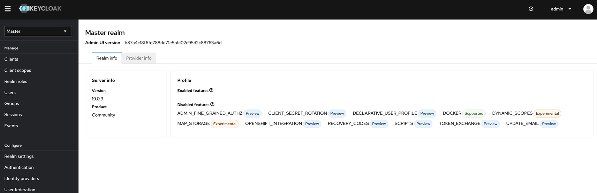

# Spring boot keycloak

* https://www.keycloak.org/getting-started/getting-started-docker
* https://www.baeldung.com/spring-boot-keycloak

## Keycloak

```shell
docker run -d -p 9010:8080 -e KEYCLOAK_ADMIN=admin -e KEYCLOAK_ADMIN_PASSWORD=admin \
 quay.io/keycloak/keycloak:22.0.1 start-dev
  
```

1. Login keycloak as admin/admin

